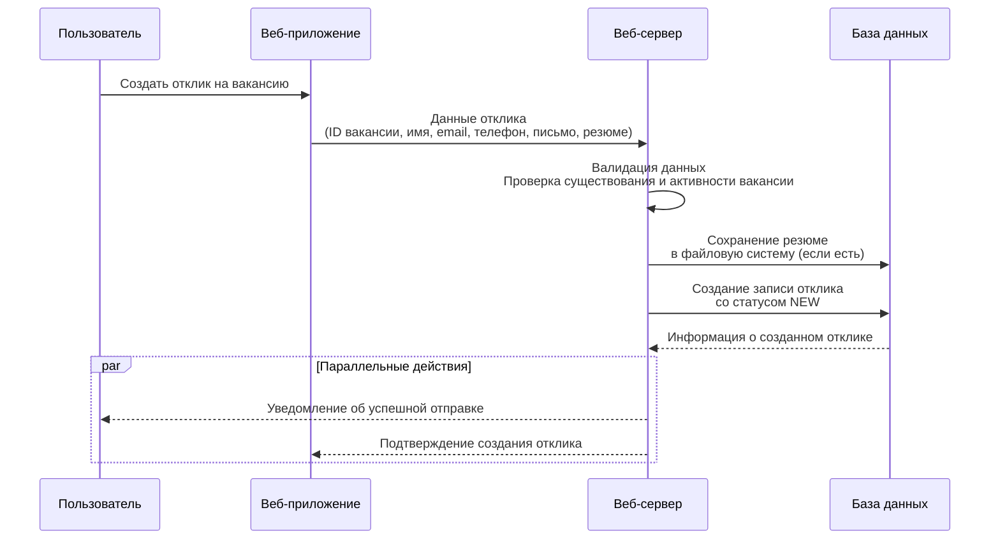

# Диаграмма последовательности: Отклик на вакансию

## Описание функционала

Диаграмма показывает процесс подачи отклика на вакансию пользователем через веб-интерфейс.

## Диаграмма последовательности

## Участники (Lifelines)

1. **Пользователь** - Кандидат, который хочет откликнуться на вакансию
2. **Веб-приложение** - Frontend приложение (React + RTK Query), содержащее форму отклика
3. **Веб-сервер** - Backend сервер (Express.js), обрабатывающий запросы и валидацию
4. **База данных** - Prisma ORM + PostgreSQL для хранения данных и файловая система для резюме

## Последовательность действий

1. **Пользователь** инициирует действие, отправляя запрос **"Создать отклик на вакансию"** в **Веб-приложение**.
2. **Веб-приложение** передает детали отклика (**ID вакансии, имя, email, телефон, письмо, резюме**) на **Веб-сервер**.
3. **Веб-сервер** выполняет валидацию данных и проверку существования и активности вакансии.
4. **Веб-сервер** сохраняет резюме в файловую систему (если файл был загружен) и создает запись отклика в базе данных со статусом 'NEW'.

**Параллельные действия (parallel block):**
После создания отклика, **Веб-сервер** выполняет два действия параллельно:

1. **Веб-сервер** отправляет **"Уведомление об успешной отправке"** обратно **Пользователю**.
2. **Веб-сервер** отправляет **"Подтверждение создания отклика"** в **Веб-приложение**.

## Модель данных

### VacancyApplication
- `id` - Уникальный идентификатор
- `vacancyId` - ID вакансии
- `fullName` - Полное имя кандидата (обязательно)
- `email` - Email кандидата (обязательно)
- `phone` - Телефон кандидата (обязательно)
- `coverLetter` - Сопроводительное письмо (опционально)
- `resumeUrl` - Путь к файлу резюме (опционально)
- `status` - Статус отклика: 'NEW', 'VIEWED', 'ACCEPTED', 'REJECTED'
- `createdAt` - Дата создания
- `updatedAt` - Дата обновления

## Обработка ошибок

1. **Валидация на клиенте**: Проверка формата email, телефона (+375 формат), размера файла
2. **Валидация на сервере**: Проверка обязательных полей, существования вакансии, её активности
3. **Обработка файлов**: Проверка типа (PDF, DOC, DOCX) и размера (≤10MB на клиенте, ≤20MB на сервере)
4. **Ошибки БД**: Обработка ошибок Prisma с возвратом 500 Internal Server Error

## Особенности реализации

- Использование FormData для отправки файлов
- Multer middleware для обработки multipart/form-data
- Валидация телефона в формате +375 (XX) XXX-XX-XX
- Опциональная загрузка резюме
- Автоматическое присвоение статуса 'NEW' новым откликам
- Связь с вакансией через foreign key (onDelete: Cascade)

